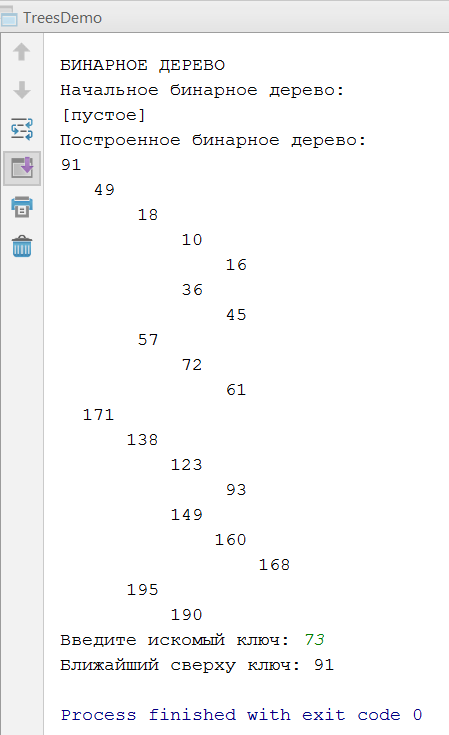

Отчет по лабораторной работе №5
======================================
ИССЛЕДОВАНИЕ И ОЦЕНКА АЛГОРИТМОВ ПОИСКА НА ДЕРЕВЬЯХ
--------------------------------------
##### Пискунов Юрий, группа 9б #####
##### Вариант 9 #####
###### 15.12.2019 ######

______________________________________

* ### Цель работы ###

  Разработка программ, реализующих алгоритмы формирования и обхода двоичных и В+ деревьев,
   а также поиска элементов в них, и оценка их временной и пространственной сложности.

* ### Задания ###

  1. *Знакомство со всеми разделами руководства*

    Со всеми разделами руководства **ознакомился**.

  2. *Получение у преподавателя задания на разработку программы для алгоритмов сортировки*

    Задание **получил**:
    <blockquote>Задание:

        1. Построить двоичное дерево, содержащее n = 15 узлов.
        Значения ключей в узлах задавать с помощью датчика случайных
        чисел с диапазоном D от 0 до 140.

        2. Построить В+ дерево, содержащее n = 15 узлов и имеющее
        степень m = 5. Значения ключей в узлах задавать с помощью датчика
        случайных чисел с диапазоном D от 0 до 140.

        3. Обеспечить обход деревьев «снизу вверх».

        4. Выполнить поиск значения ключа по близости снизу.
    </blockquote>

  3. Пошаговые **алгоритмы построения**:

    - **двоичного дерева**:

        1. Первый элемент с ключом р[1] становится корнем дерева.

        2. Значение ключа второго узла р[2] сравнивается с р[1] (корня
        дерева). Если р[2] < p[1], то второй элемент помещается на левой от
        корня ветви, в противном случае – на правой. В результате будет
        получено упорядоченное дерево из первых двух узлов.

        3. Далее на каждом шаге создается упорядоченное дерево из
        первых i элементов. Выбор i-го узла производится следующим
        образом. Ключ р[i] сравнивается с корневым значением и
        выполняется переход по левому адресу (если р[1]>р[i]), в противном
        случае (при р[1] <= р [i]) – по правому адресу. Далее ключ
        достигнутого узла также сравнивается с р[i], и снова организуется переход по левому и правому адресу и т.д. При нахождении
        незаполненного адреса связи ему присваивается ключ р[i].
        Этот пункт повторяется до тех пор, пока не будут включены в
        дерево все элементы исходного массива.

    - **В+ дерева**:

        1. Если дерево пусто, заменить его на дерево с одним корневым
        узлом ((K,V), ПУСТО, ПУСТО) и остановиться
        Иначе сравнить K с ключом корневого узла X:

        2.
            + Если K>=X, рекурсивно добавить (K,V) в правое поддерево Т
            + Иначе (если K<X) рекурсивно добавить (K,V) в левое
        поддерево Т.

  4. Тексты программ построения:

    - **двоичного дерева**:

      ```java
      public void insert(int newKey) {
          if (root != null) {
            insertTo(root, newKey);
          } else {
            root = new Node(newKey);
          }
      }

      private void insertTo(Node node, int newKey) {
        if (node.key == newKey) {
//            ignore
        } else if (newKey < node.key) {
            node.left = insertToNullableNode(node.left, newKey);
        } else if (newKey > node.key) {
            node.right = insertToNullableNode(node.right, newKey);
        }
      }

      private Node insertToNullableNode(@Nullable Node node, int newKey) {
        if (node != null) {
            insertTo(node, newKey);
          } else {
            node = new Node(newKey);
          }
        return node;
      }
      ```

    - **В+ дерева**:

  5. **Распечатки результатов**, полученных с помощью ЭВМ:

    

  6. Пошаговые **алгоритмы построения**:

    - **на двоичном дереве**:

      1. Если дерево пусто, сообщить, что узел не найден, и остановиться.

      2. Иначе сравнить K со значением ключа корневого узла X.

        + Если K=X, выдать ссылку на этот узел и остановиться

        + Иначе

            -  если K>X, рекурсивно искать ключ K в правом поддереве Т.
            -  иначе (если K<X) рекурсивно искать ключ K в левом поддереве Т.

    - **на В+ дереве**:

      1. Начинаем от корня

      2.  
        + Если X –один из ключей текущего узла, то СТОП, ключ найден.

        + Иначе находим пару соседних ключей Y, Z, таких что X лежит в интервале от Y до Z.

      3. Переходим к потомку между Y и Z.
      4. Возврат к шагу 2.
      5. Если дошли до листа и Х нет среди ключей, то СТОП, ключ и элемент не найден.

  7. **Выводы о сложности разработанных алгоритмов**:

    - **Двоичного дерева**:

      + Построение:

      + Поиск:

    - **Бинарного дерева**:

      + Построение:

      + Поиск: **O(t*log(t*n))**, где t – минимальная степень.


* ### Вывод ###

  Разработал алгоритмы и программы, осуществляющие формирование и обход двоичных и В+ деревьев,
  а также поиск элементов в них.
